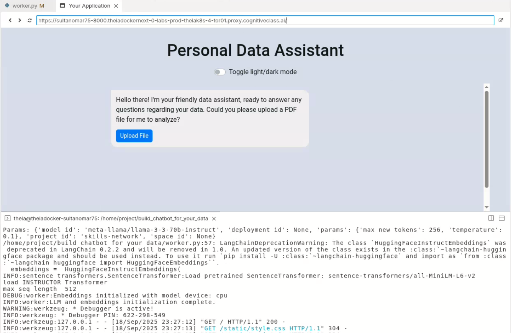
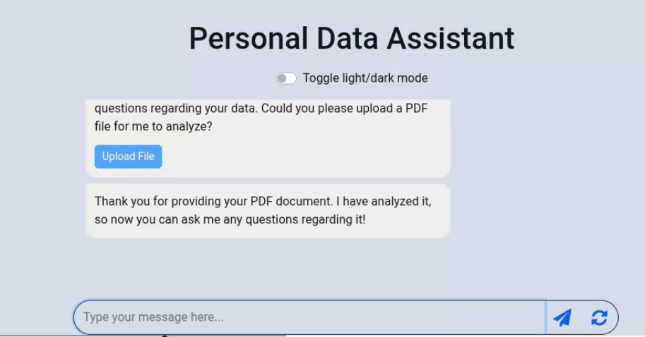
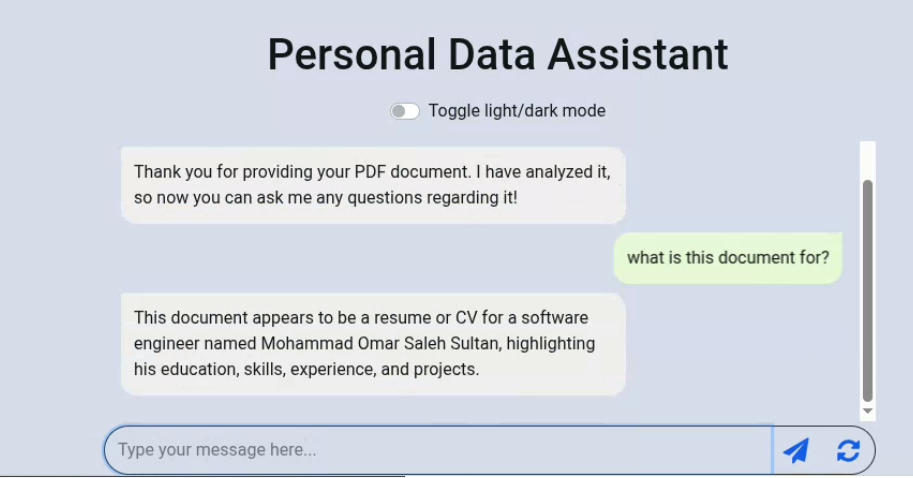

# 📄 Document Summarizer AI with Hugging Face + LangChain

This project is a **Document Summarization and QA System** that extracts text from uploaded documents (PDF/DOCX), saves it into memory, and allows you to **ask questions in a chat interface**.
The system uses **Hugging Face models**, **LangChain**, and **Python** to deliver intelligent answers based on the uploaded content.

It demonstrates how **AI models can be integrated into real-world applications**, combining NLP with document processing and interactive querying.

---

## 🚀 Project

Here’s a short preview of how it works:

- Upload a document (`.pdf` / `.docx`)
- The app extracts and stores the document contents
- Ask questions in the chat box
- Get summarized answers **directly from the uploaded document**

---


## 🚀 Project

Here’s a short preview of the system in action:


---


## 📸 Screenshots

<p align="center">
  

</p>

<p align="center">
  
  
</p>

---

## ⚙️ Tech Stack

- [Flask](https://flask.palletsprojects.com/) – backend web framework
- [LangChain](https://www.langchain.com/) – for building conversational pipelines
- [Hugging Face Transformers](https://huggingface.co/docs/transformers/index) – NLP models for summarization & embeddings
- [Sentence-Transformers](https://www.sbert.net/) – embeddings for semantic similarity
- [ChromaDB](https://docs.trychroma.com/) – vector database for storing document chunks
- [pypdf / pdf2image](https://pypi.org/project/pypdf/) – PDF parsing & text extraction
- [Pandas / NumPy / SciPy](https://pandas.pydata.org/) – data handling utilities
- [BeautifulSoup4 (bs4)](https://www.crummy.com/software/BeautifulSoup/) + [Requests](https://docs.python-requests.org/) – extra data parsing

---

## 🧠 Model Used

The project uses **Hugging Face language models** for summarization and question answering.

- **Embeddings** → `sentence-transformers` / InstructorEmbedding for storing document chunks in ChromaDB
- **Summarization & QA** → Hugging Face transformer models (BART, T5, or similar)
- **LangChain pipeline** → manages chat history, memory, and retrieval

In simple terms:
1. The document is split into chunks.
2. Chunks are stored as embeddings in a vector database.
3. When you ask a question, the most relevant chunks are retrieved.
4. A Hugging Face model generates an answer from those chunks.

---

## 🛠️ How to Run Locally

# 1. Clone the repo
```bash
git clone https://github.com/your-username/document-summarizer-ai.git
cd document-summarizer-ai
```

# 2. Create a virtual environment (recommended)
```bash
python3 -m venv venv
source venv/bin/activate   # Linux/Mac
venv\Scripts\activate      # Windows
```
# 3. Install dependencies
```bash
pip install -r requirements.txt
```
# 4. Run the app
```bash
python app.py
```
# 5. Open in browser
```bash
http://127.0.0.1:7860
```

🔮 Future Improvements
Support for multiple document uploads
Integration with WatsonX.ai for enterprise-level summarization
Add multi-language support
Deploy on Hugging Face Spaces / Streamlit Cloud for public demo

👨‍💻 Author
Built by Sultan Omar